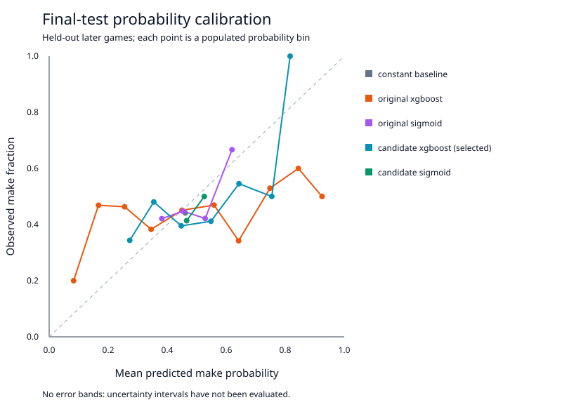

# Evaluation methodology and evidence

## What is and is not established

The original repository contains a saved XGBoost model and joblib metadata, but no raw data snapshot, chronological partition manifest, or complete reproducible evaluation. Its saved score is a historical claim, not a newly reproduced measurement. The original training/analysis code is retained in Git history at `61d3b8d`.

Live NBA retrieval and a complete real-data evaluation succeeded for Stephen Curry's 2023–24 regular season. The selected model improved on the original parameter reference on the final holdout, but **did not beat the constant baseline's log loss or Brier score**. This is evidence of a more credible evaluation process and a better result than the reference recipe on this split, not proof of reliable NBA shot prediction. The exact evidence is included below.

The pipeline also runs without the network using an explicitly synthetic fixture. Such a run establishes software behavior and allows regression checks; it does not measure actual NBA skill. Every real-data result must identify its player ID, season, retrieved source, cleaned sample counts, chronological split, dependency versions, and model ID.

## Reproducible comparisons

The reference XGBoost uses the original recipe: 300 trees, depth 4, learning rate 0.05, row/column subsampling 0.8, and random seed 42. It is retrained with the shared geometry features and chronological splits. This provides a controlled parameter reference, not a bit-for-bit reproduction of the original random-split model. A constant probability baseline uses a Laplace-smoothed training rate, `(training_makes + 1) / (training_attempts + 2)`, with no held-out labels.

The regularized candidate uses 240 trees and depth 3. Its complete parameters are recorded in the bundle. Preprocessing is deterministic: distance and shot type come from the same geometry used at inference, categorical encoding is fixed, and no scaler or imputer is fitted on held-out data. Records with invalid outcomes, missing event identity/dates/coordinates, out-of-domain locations, and conflicting shot types are removed and counted. Identical events are deduplicated; contradictory event duplicates are excluded.

## Time-aware data partitions

1. Sort distinct games chronologically, preserving every game's attempts in one partition.
2. Allocate approximately 60% of games to training, 20% to validation, and 20% to final testing, subject to integer rounding.
3. Divide validation chronologically into an earlier calibration portion and a later selection portion. This prevents assessing a fitted calibrator on the same labels used to fit it.
4. Fit XGBoost on training only. Fit sigmoid calibration using the calibration portion only. Use later validation log loss to select among the supported candidate/probability variants.
5. Freeze the selection, then compute final-test metrics. Never fit preprocessing, calibration, or model parameters using final-test labels.

Training requires at least 150 usable attempts and 15 games. Training, calibration, selection, and final testing must each contain at least 20 attempts and both outcomes. A single-class or undersized dataset causes a descriptive failure instead of an unstable score. Small samples remain a limitation even after passing these guardrails.

Partition game IDs, time ranges, row counts, target rates, and evaluation measurements travel with the model. This protects against accidental mixing of attempts from one game and supports repeatability. When comparing future changes, keep the same source snapshot and final-test partition; repeated development against a published test set requires a new untouched final holdout.

## Metrics and calibration

| Metric | Better direction | Interpretation |
| --- | --- | --- |
| ROC-AUC | Higher | Ranking of makes above misses. It does not establish calibrated probabilities. |
| Log loss | Lower | Probability scoring rule that strongly penalizes confident mistakes. |
| Brier score | Lower | Mean squared probability error. |
| Reliability plot | Near diagonal | Average predicted probability versus observed make rate in populated bins; bin counts show support. |

Reports include both the smoothed training-rate reference and XGBoost variants on the same held-out rows. The constant baseline is eligible for selection, so an unhelpful spatial model need not be served merely to retain model complexity. The final test is used only for the final report, not to select the winner. A model should not be called improved merely because it is more complex, calibrated, or has better training performance. Report the actual comparison and acknowledge mixed results when metrics disagree.

Calibration curves are descriptive aggregate checks. Sparse bins are noisy, a held-out season can differ from the next season, and calibration does not produce a confidence interval for one shot. No uncertainty interval or validated coverage claim is implemented.

## Explanation verification

XGBoost's exact TreeSHAP contributions are computed in raw margin (log-odds) units. The sum of the base margin and feature contributions must reconstruct the raw model margin within a numerical tolerance. The raw margin is then converted through the bundle's selected probability transform, including sigmoid calibration when selected. The served probability must agree with this reconstruction.

Explanations carry contribution units and reconstruction diagnostics. If checks fail, the system must report the failure rather than turn off the check or label raw log-odds as percentage points. Correlated coordinates, distance, shot type, and angle describe the same geometry; their individual contribution allocation is a model explanation rather than a causal decomposition of shooting skill.

## Reproduce a run

```bash
python -m pip install -r requirements-dev.txt
python -m pytest -q
python train_and_save_model.py --demo --season 2023-24
python train_and_save_model.py --player-id 201939 --season 2023-24
```

The first training command is reproducible synthetic data (60 games, 24 attempts per game, seed 42, player ID 0). The second requests real Stephen Curry shot data; network/cache availability determines whether it can complete. `requirements-lock.txt` records the exact installed Python 3.12 verification environment, including development dependencies; use `python -m pip install -r requirements-lock.txt` to reproduce it. The bounded `requirements.txt` and `requirements-dev.txt` support routine installation and the Python 3.11/3.12 CI matrix. A different dependency resolution or refreshed upstream response may change model results.

## Observed NBA evaluation: Curry, 2023–24

Model ID: `p201939-2023-24-20260905T184018153423Z-fe3743c6`.

The NBA source was fetched on **2026-09-05 at 18:33:57 UTC**. Training at 18:40:18 UTC used that fresh disk cache. Of 1,445 returned attempts, 2 were outside the supported half court; the remaining **1,443 attempts across 74 games** passed cleaning. No missing values, duplicate events, or shot-type geometry conflicts were removed in this run. The actual XGBoost fitting subset contains **872 attempts**, not the full cleaned dataset.

| Partition | Games | Attempts | Dates | Purpose |
| --- | ---: | ---: | --- | --- |
| Training | 44 | 872 | 2023-10-24–2024-02-05 | Fit both XGBoost models and the constant baseline. |
| Early validation | 7 | 139 | 2024-02-07–2024-02-22 | Fit sigmoid calibration. |
| Later validation | 7 | 133 | 2024-02-23–2024-03-06 | Select by log loss. |
| Final test | 16 | 299 | 2024-03-07–2024-04-12 | Report frozen-model results. |

The uncalibrated regularized candidate was selected on later-validation log loss **0.675348**, narrowly ahead of the constant baseline **0.675667**. This narrow advantage did not persist on the later final test. The selected model was not changed after reading the test results.

| Model variant | Final-test ROC-AUC ↑ | Final-test log loss ↓ | Final-test Brier ↓ | Selected before final test? |
| --- | ---: | ---: | ---: | --- |
| Constant smoothed training rate | 0.500000 | 0.687057 | 0.246960 | No |
| Original XGBoost parameter reference | 0.511659 | 0.772124 | 0.280278 | No |
| Original + sigmoid calibration | 0.511659 | 0.690262 | 0.248558 | No |
| Regularized XGBoost candidate | 0.535157 | 0.701130 | 0.253452 | **Yes** |
| Regularized candidate + sigmoid | 0.535157 | 0.686991 | 0.246934 | No |

The selected model's test log loss is **0.070994 lower than the original parameter reference**, but **0.014073 higher than the constant baseline**. Its AUC of 0.535157 shows weak ranking on these held-out games. Although the calibrated candidate's test losses are slightly lower than the constant baseline's, it was not the validation-selected variant and these tiny differences do not demonstrate a statistically reliable improvement. No significance test, confidence interval, cross-season evaluation, or multi-player benchmark has been established.



The exact [metadata and partition manifest](evidence/curry-2023-24/metadata.json), [per-attempt held-out predictions](evidence/curry-2023-24/test_predictions.csv), and [calibration plot](evidence/curry-2023-24/calibration.svg) are committed as evidence. Metadata records Python 3.12.14, NumPy 2.5.2, pandas 2.3.3, scikit-learn 1.9.0, XGBoost 3.4.1, and nba_api 1.11.4. The raw response SHA-256 is `3f59d11224173f21236d47a30e849bb35018eab4e1f4078d6f4603992ccb57aa`; the cleaned feature/target snapshot SHA-256 is `ce98999b230ba98290b77987fdd3d5b316889f347347ee7c7005139ecdede326`.

The source response remains in the local ignored cache. Committed held-out predictions reproduce the reported test metrics; refitting requires the same source response or a refetch that matches its recorded digest. Native model weights remain in the local versioned bundle and are not confused with the original repository's historical artifacts.

## Remaining data limitations

Regular-season shots omit defender location, shot contest, player fatigue, shot clock, pass quality, injury status, and other contexts relevant to shot success. These are not silently fabricated. Source shot coordinates are quantized and do not establish foot placement; excluding geometry conflicts can introduce selection effects, so the report exposes their counts. Half-court filtering excludes heaves. Models do not generalize automatically across players or seasons. Historical free throws are a separate statistic and are never scored through this field-goal model.
